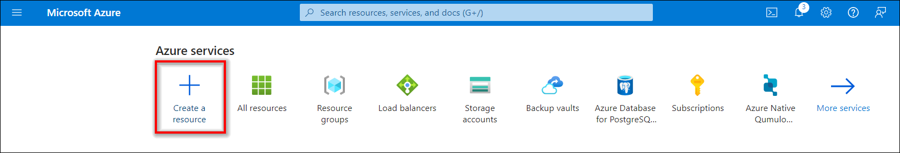
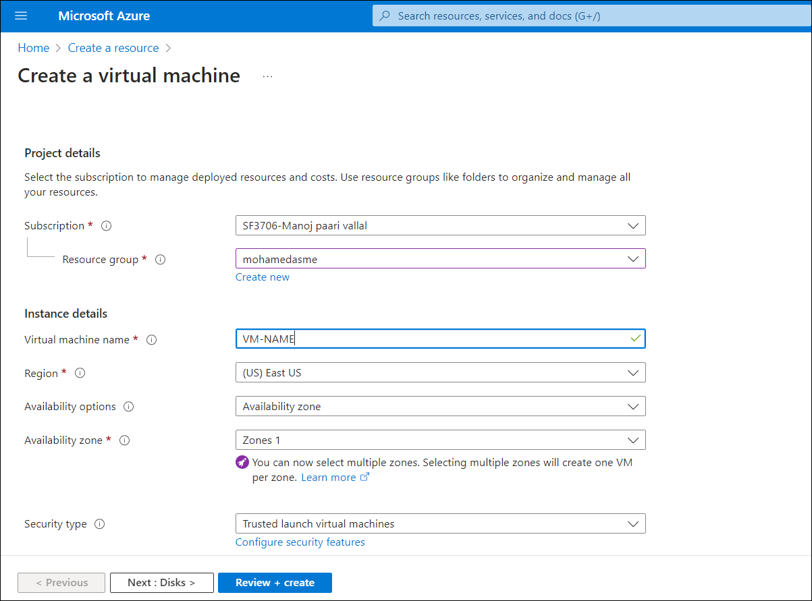
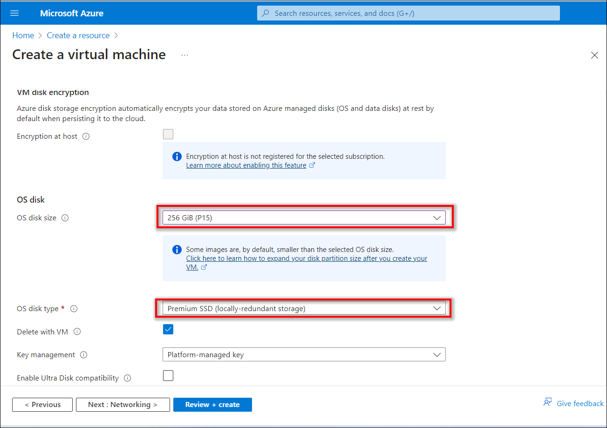

# Self-deploy a Bold BI Server on Microsoft Azure Linux Ubuntu VM
To install and run the Bold BI server on a Microsoft Azure Linux Ubuntu virtual machine, follow these steps in a concise manner.
## Set up a Microsoft Azure VM
 - Sign into the [Azure Portal](https://portal.azure.com/).
 - Click on `Create a Resource`.

 
 - Click on `virtual machine`.

 
 - Provide the necessary administrative information for the new VM on the `Basics` blade.
 - **Virtual Machine Name:** Enter a name for your VM (max 15 characters).
 - **Subscription:** This VM should be associated with the Azure subscription.
 - **Resource group:** Choose `Create new` and enter the name of a new resource group to host the VM’s resources.
 - **Region:** Choose your preferred region for your VM.

 - **Image:** Choose `Ubuntu SeRver 20.04 LTS-x64 Gen2` image.
 - **Size:** Choose the VM size that meets our [system requirement](https://help.boldbi.com/deploying-bold-bi/overview/#hardware-requirements). For example, choose the `D2s_V3 size`, and then `click` Select.

 - **Username:** Enter your username, which you will use to log in to the VM using Terminal.
 - **Password:** Enter your password, as you will need it to log in to the VM using Terminal.
 - **Inbound Ports:** Choose All port in check Box `HTTP,HTTPS and SSL`.

 - Under the `Disks` blade, choose the VM OS disk type (SSD is recommended).
 - choose OS Disk size `256GiB` 
 
 - Click on `Review + create`

## Installation and Running of the Bold BI Server ##
 - connect the Azure Ubuntu Linux Ubuntu VM [help Link](https://learn.microsoft.com/en-us/azure/virtual-machines/linux-vm-connect?tabs=Windows).
 - Install the Bold BI in Linux Environment [help Link](https://help.boldbi.com/deploying-bold-bi/deploying-in-linux/installation-and-deployment/bold-bi-on-ubuntu/).

 - Follow the steps in the link to do the [application startup](https://help.boldbi.com/application-startup/).