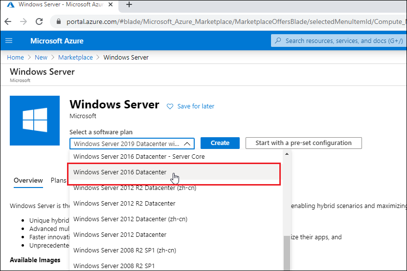

# Deploy a Bold BI Server on Microsoft Azure Virtual Machine

For installing and running the Bold BI server on a Microsoft Azure virtual machine, adhere to these streamlined steps.
<ul>
<ol> 

1.[installation stpes for boldbi on windows virtual machine](self-deploy-azure-ubuntu-vm.md/#installation-stpes-for-boldbi-on-windows-virtual-machine)

2.[Installation stpes for Boldbi on Linux virtual machine](self-deploy-azure-ubuntu-vm.md/#installation-stpes-for-boldbi-on-linux-virtual-machine)
</ol>
</ul>

## Installation stpes for Boldbi on windows virtual machine
### Deploy a Windows virtual machine on Azure
* Sign into the [Azure Portal](https://portal.azure.com/).

* Click on `Create a Resource`.

    

* Under `Azure Market place`, select `Compute` option and click on `See all` featured.

    

* Search for `Windows Server` and select it.

    

* Choose the `Windows Server` software plan that meets our [system requirement](/deploying-bold-bi/overview/#hardware-requirements) and click `Create`.

    

* Provide the necessary administrative information for the new VM on the `Basics` blade.

    

**Virtual Machine Name:** Enter a name for your VM (max 15 characters).

**VM disk type:** Choose SSD/HDD as your convenience (SSD is recommended for better performance).

**Size:** Choose the VM size that meets our [system requirement](/deploying-bold-bi/overview/#hardware-requirements). For example, choose the `D2s_V3` size, and then click `Select`.

**Username:** Enter your username, which you will use to log in to the VM using Remote Desktop Protocol (RDP).

**Password:** Enter your password, as you will need it to log in to the VM using RDP.

**Subscription:** This VM should be associated with the Azure subscription.

**Resource group:** Choose `Create new` and enter the name of a new resource group to host the VM's resources.

**Region:** Choose your preferred region for your VM.

* Under the `Disks` blade, choose the VM OS disk type (`SSD` is recommended).

    

* Under the `Networking` blade, select `Advanced` in `NIC network security group`.

    

* Click on `Create new` in the `NIC network security group` option to add an inbound security rule. This rule will allow specific types of internet traffic to reach your VM. 

    

* Choose `HTTP` from the `Service` drop-down list on the `Add inbound security rule` blade.

* In the "Priority" box, assign a numerical priority to the rule, such as 100. Rules with lower numbers are processed first. For instance, a rule with a priority of 100 will be processed before a rule with a priority of 110.

* In the Name box, type a name for the inbound rule, such as HTTP Port-80, and then click OK.

* Repeat the steps to create an inbound security rule for the HTTPS service with a priority of 101.

* When finished, the Create network security group dialog should have three rules allowing `RDP, HTTP, and HTTPS` access. Click OK.

* On the `Create` blade, review your settings under Summary and click `Create`.

    

## How to Connect the VM through the Remote Desktop Connection

Follow the below steps to connect to the virtual machine.

* Click `Connect` on the virtual machine overview window to download a Remote Desktop Protocol (`.rdp`) file from the Azure portal.

    

* Open the .rdp file and click `Connect` to proceed despite the warning from an unknown publisher.

    

* Enter the credentials that you provided when creating the VM, as shown below, and click OK.

    

* After a successful connection, the identity verification window will be displayed as shown below. Click `OK` to accept the certificate problems and connect to the virtual machine.

    

## Installation and Running of the Bold BI Server

This section provides instructions on how to install and run the Bold BI server in a virtual machine (VM).

* Install the Bold BI server on the created virtual machine (VM) in the Azure portal using [help link](/deploying-bold-bi/deploying-in-windows/installation-and-deployment/). 
* Launch your application either by default or through your Desktop shortcut menu item. For example, `Start Bold BI in IIS`

    

* Follow the steps in the link to do the [application startup](/application-startup/).

## Installation stpes for Boldbi on Linux virtual machine

### Deploy a Linux virtual machine on Azure
 - Sign into the [Azure Portal](https://portal.azure.com/).
 - Click on `Create a Resource`.

    
 - Click on `virtual machine`.

    
 - Provide the necessary administrative information for the new VM on the `Basics` blade.

 **Virtual Machine Name:** Enter a name for your VM (max 15 characters).
 
 **Subscription:** This VM should be associated with the Azure subscription.
 
 **Resource group:** Choose `Create new` and enter the name of a new resource group to host the VM’s resources.
 
 **Region:** Choose your preferred region for your VM.
    

 **Image:** Choose `Ubuntu Server 20.04 LTS-x64 Gen2` image.
 
 **Size:** Choose the VM size that meets our [system requirement](https://help.boldbi.com/deploying-bold-bi/overview/#hardware-requirements). For example, choose the `Standard_D2s_v3`.

 
 **Username:** Enter your username, which you will use to log in to the VM using Terminal.
 
 **Password:** Enter your password, as you will need it to log in to the VM using Terminal.
 
 **Inbound Ports:** Choose All port in check Box `HTTP,HTTPS and SSL`.

 - Under the `Disks` blade, choose the VM OS disk type (SSD is recommended).
 - Choose OS Disk size `256GiB` 

 
 - Click on `Review + create`

## Installation and Running of the Bold BI Server ##
 - Connect the Azure Linux Ubuntu VM [help Link](https://learn.microsoft.com/en-us/azure/virtual-machines/linux-vm-connect?tabs=Windows).
 - Install the Bold BI in Linux Environment [help Link](https://help.boldbi.com/deploying-bold-bi/deploying-in-linux/installation-and-deployment/bold-bi-on-ubuntu/).

 - Follow the steps in the link to do the [application startup](https://help.boldbi.com/application-startup/).